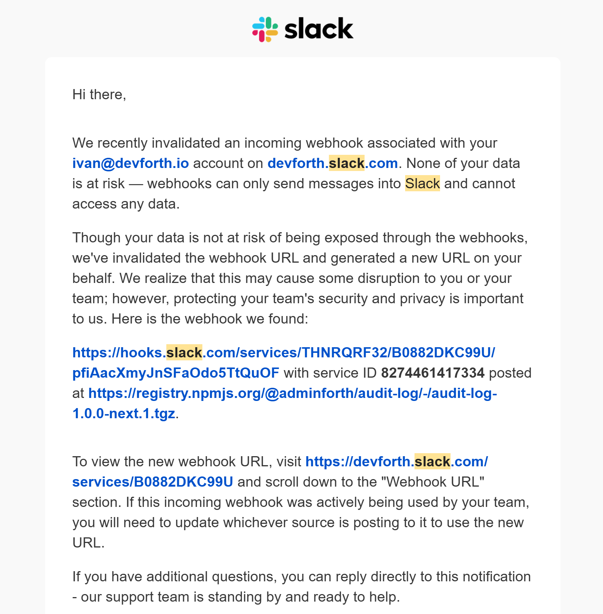
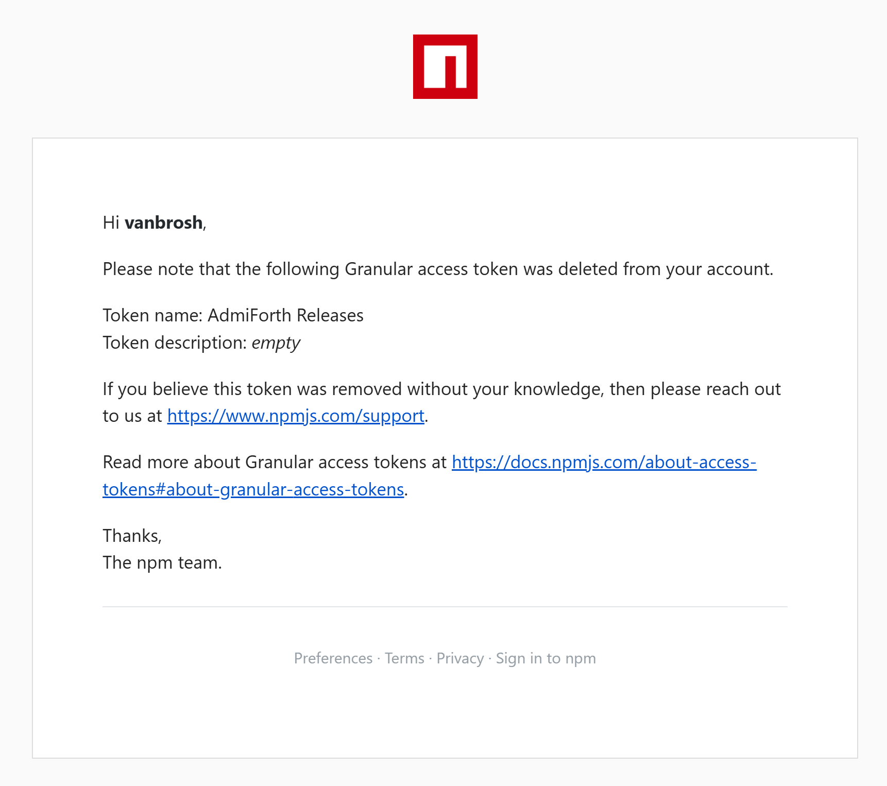

Our framework has a CI pipeline which doews `npm run build`, makes npm release (`npm publish`), and creates a new release on Github. Also it sends notification about release to Slack webhook for our team. 

Secrets for these services were stored in our CI built-in Vault. (We are running self-hosted Woodpecker CI).

Recently when I was moving plugins to separate repositories, I decided to try [infiscal](https://infisical.com/) for centralized secrets management instead of internal CI Vault. Infiscal provides self-hosted open-source soluition as well, and has well-orginized UI and better access control then our CI Vault. For me it was important that I can reuse secrets for different repositories without copying them every time when I create a new plugin.

So what I did:


```yaml title=".woodpecker.yml"
  
steps:
//diff-add
  init-secrets:
//diff-add
    when:
//diff-add
      - event: push
//diff-add
    image: infisical/cli
//diff-add
    environment:
//diff-add
      INFISICAL_TOKEN:
//diff-add
        from_secret: VAULT_TOKEN
//diff-add
    commands:
//diff-add
      - infisical export --domain https://vault.devforth.io/api --format=dotenv-export --env="prod" > .vault.env
//diff-add
    secrets:
//diff-add
      - VAULT_TOKEN

  release:
    image: node:20
    when:
      - event: push
    commands:
//diff-add
      - export $(cat .vault.env | xargs)
      - cd adminforth
      - npm clean-install
      - npm run build
      - npm audit signatures
      # does publish to npm, creates release on github, and sends notification to slack webhook
      - npx semantic-release 
//diff-remove
    secrets:
//diff-remove
      - VAULT_NPM_TOKEN
//diff-remove
      - VAULT_GITHUB_TOKEN
//diff-remove
      - VAULT_SLACK_TOKEN
```

Pretty dump method to export secrets to `.vault.env` file, but it was late evening and I did not want to spend much time on it for start.

I made a first push, and everything worked fine from first attmpt. I was happy.

Then I started to add same code to first plugin. And plugin build failed with very unexpected error. 

It said that my npm token is invalid. I was surprised, started to print env to see what is wrong (pritnting env to build log is pretty bad practice and is last thing you want to do, but I knew it is internal CI and project is private).

And I saw that my npm token is not in env and was the same.

I went to first repository and retried build. And it failed with the same error.

I went to npm and found out that token disappeared at all. I was shocked and recreated it.

On next build I figured out that Slack webhook is also not working. GitHub releases were created fine without issues on both repositories.

Then I noticed email push notification from Slack called "Notification about invalidated webhook URLs"





This was the moment when I realized that npm publish simply took my `.vault.env` file and published it to npm.

Now I detected recent email from npm called "Granular access token deleted"



Next thing I did was revoking all tokens including Github which still worked and unpublished all packages from npm (though they still might be cloned by some caches / aggregators / archivers).

# How services care about leaked secret tokens

## GitHub

GitHub was not able to recognize that token was leaked to npm package and revoke it. Though they do pretty-good work when you push some other vendor secrets to GitHub repository, but seams they don't check npm sources.

## NPM 

NPM understood that npm token was published to npm registry and revoked it. Though it was hard to understand why: they simple deleted it. They sent email, but email did not say why it was deleted and did not specefie leak source. Probably showing some error in tokens list on npm website would be best option.

## Slack

I surprised, but Slack did a great job. They monitor npm (don't think they monitor whole npm, probably there is some interesting technology behind it). They detected that npm token was published to npm registry and invalidated it. They sent email with clear explanation why it was invalidated and what to do next.

# Conclusion

We can say a lot on bad programmers practices, but the main thing is that we are humans. And humans still make mistakes. 
So it makes a lot of sense to monitor for such human errors.
In my case NPM and Slack saved me from potential security breach. If not them I would learn about the issue only when someone would use my tokens for bad purposes.
GitHub did nothing to detect and revoke token, many other services would not do it as well.

I can also give some common recommendations I learned from this story:

- try to limit tokens access to only needed granulas as much as possible. Even if something will be leaked, it will not be able to do much harm. Don't add access to all resources/packages/repos if you don't need it.
- check what you publish at least when you change something in your build pipeline. I did miss the fact .env file was published.
- appreciate services which monitor for such leaks and react on them. They can save you from potential security breach.