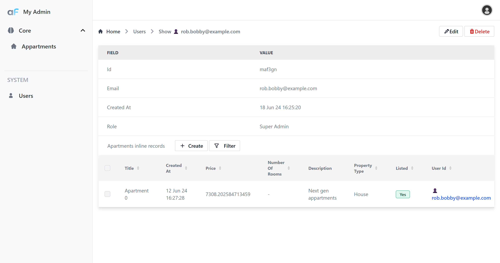

Foreign inline list plugin allows to display a list (table) of items from a foreign table in the show view.

## Usage


Import plugin:

```ts
import ForeignInlineListPlugin from 'adminforth/plugins/ForeignInlineListPlugin';
```
If yu are using pure Node without TypeScript, you can use the following code:

```js
import ForeignInlineListPlugin from 'adminforth/dist/plugins/ForeignInlineListPlugin/index.js';
```

In [Getting Started](<../Getting Started.md>) we created a `'apparts'` resource which has a field `'user_id'`.
This field refers to record from `'users'` resource. This means that we can display a list of appartments in the user's show view.

Add to your `'users'` resource configuration (which we created in ), plugin instance:


```ts
{ 
    ...
    resourceId: 'users',
    ...
    plugins: [
      new ForeignInlineListPlugin({
        foreignResourceId: 'apparts',
        modifyTableResourceConfig: (resourceConfig: AdminForthResource) => {
          // hide column 'square_meter' from both 'list' and 'filter'
          const column = resourceConfig.columns.find((c: AdminForthResourceColumn) => c.name === 'square_meter')!.showIn = [];
          resourceConfig.options!.listPageSize = 1;

          // feel free to console.log and edit resourceConfig as you need
        },
      }),
    ],
}
```

You can use `modifyTableResourceConfig` callback to modify what columns to show in the list and filter of the foreign table.



See [API Reference](/docs/api/plugins/ForeignInlineListPlugin/types/type-aliases/PluginOptions) for more all options.