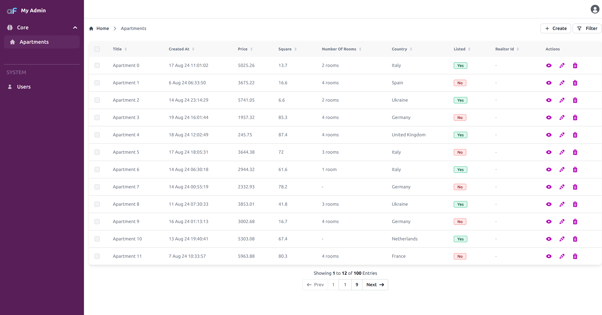
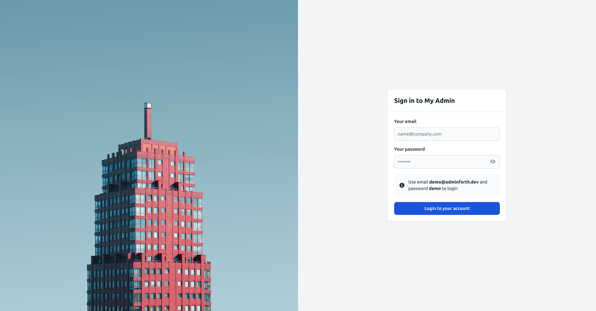

# Branding and Theming

The first things you would probably like to change are the logo, favicon and the name of the application. 

First of all create directory named `custom` at the same level with your TypeScript/JavaScript index file. 

We will use this directory for all custom components. If you want to call your dir with other name then `custom`, just set [customComponentsDir option](/docs/api/types/Back/interfaces/AdminForthConfig#customcomponentsdir)

Place your logo file into the `custom` directory e.g. (`logo.svg`)

Also place your favicon into the `custom` directory e.g. (`favicon.png`)

Then you can change the branding of the application in the configuration:

```ts title='./index.ts'

const admin = new AdminForth({
  ...
  customization: {
//diff-remove
    brandName: "myadmin",
//diff-add
    brandName: 'My App',  // used in login page and sidebar
//diff-remove
    title: "myadmin",
//diff-add
    title: 'My App Admin',  // used to set HTML title tag
//diff-remove
    brandLogo: '@@/assets/logo.svg',
//diff-add
    brandLogo: '@@/logo.svg',
//diff-remove
    favicon: '@@/assets/favicon.png',
//diff-add
    favicon: '@@/favicon.png',
//diff-add
  },
  ...
});
```

Please note that `@@/` is a special prefix which tells AdminForth to look for the file in the `custom` directory. 
You can use `@@/` prefix for all paths in the configuration and also import images like this in your custom components e.g.:

```ts
<template>
  
</template>
```

## Removing brand name from sidebar


If you are using logo image which has branded title inside, you might
want completely remove default text brand name from sidebar:

```ts title='./index.ts'
brandName: 'My App',
//diff-add
showBrandNameInSidebar: false,
```

`brandName` will still be used in the other places e.g. login form.

## Theming

AdminForth uses TailwindCSS for styling. You are able to customize the look of the application by changing the TailwindCSS configuration.

Use [styles.ts](https://github.com/devforth/adminforth/blob/main/adminforth/modules/styles.ts) file to see which variables are available for change.

Let's say your brand has a primary purple color and you wish to make side bar purple with white text.

In `index.ts` file set the `styles` property in the configuration:

```ts title='./index.ts'

const admin = new AdminForth({
  ...
  customization: {
//diff-add
    styles: {
//diff-add
      colors: {
//diff-add
        light: {
//diff-add
          // color for links, icons etc.
//diff-remove
          primary: '#1a56db',
//diff-add
          primary: '#b400b8',
//diff-add
          // color for sidebar and text
//diff-remove
          sidebar: { main: '#f9fafb', text: '#213045' },
//diff-add
          sidebar: {main:'#571e58', text:'white'},
//diff-add
        },
//diff-add
      }
//diff-add
    } 
  },
  ...
});
```
Here is how it looks:



## Square vs rounded buttons?

Not an issue, just change:

```ts title='./index.ts'
styles: {
//diff-add
  borderRadius: {
//diff-add
    "default": "0px"
//diff-add
  }
}
```

## Login background

To make login interface less boring background image matters.

For example you might want to get [free sweet background](https://unsplash.com/s/photos/secure?license=free) from Unsplash like
[Nate Watson's apartments view](https://images.unsplash.com/photo-1516501312919-d0cb0b7b60b8?q=80&w=3404&auto=format&fit=crop&ixlib=rb-4.0.3&ixid=M3wxMjA3fDB8MHxwaG90by1wYWdlfHx8fGVufDB8fHx8fA%3D%3D).

Download it to `custom` directory, and just set it in the configuration:


```ts title='./index.ts'
const admin = new AdminForth({
  ...
  auth: {
    ...
//diff-add
    loginBackgroundImage: '@@/photo-1516501312919-d0cb0b7b60b8.jpeg',
  },
  ...
});
```
Here is how it looks:


You can also set background position and size:

```ts title='./index.ts'

auth: {
  ...
  loginBackgroundImage: '@@/photo-1516501312919-d0cb0b7b60b8.jpeg',
//diff-add
  loginBackgroundPosition: 'over',
}
```

`loginBackgroundPosition` accepts values:

- `over` - image will be over the whole login page with cover mode
- `1/2`(default), `3/4`, `2/5`, `3/5` etc. - image will be in the left side of the login page with cover mode