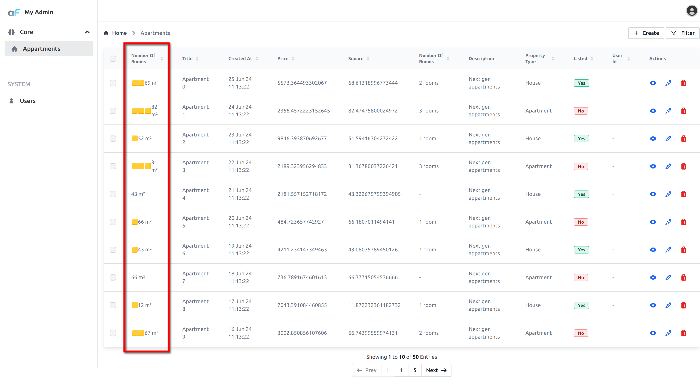

# Custom record field rendering

## Customizing how AdminForth renders the cells with record values

Let's change how AdminForth renders the number of rooms in the 'list' and 'show' views.
We will render '🟨' for each room and then we will print `square_meter` at the same cells.

Create directory `custom`. Create a file `RoomsCell.vue` in it:

```html title='./custom/RoomsCell.vue'
<template>
  <div class="flex items-center">
    <span v-for="room in record.number_of_rooms">
      🟨
    </span>
      
    {{ record.square_meter }} m²
  </div>
</template>

<script setup>
defineProps({
  record: Object
});
</script>
```

Now you can use this component in the configuration of the resource:

```ts title='./index.ts'
{
  ...
  resourceId: 'aparts',
  columns: [
    ...
    {
      ...
      name: 'number_of_rooms',
//diff-add
     components: {
//diff-add
       show: '@@/RoomsCell.vue',
//diff-add
       list: '@@/RoomsCell.vue',
//diff-add
     }
    },
    ...
  ],
  ...
}
```
Here is how it looks:


In very similar way you can render how cell is rendered in `'edit'` and `'create'` view. 
You can use it for creating custom editors for the fields. Check [component specs](/docs/api/types/AdminForthConfig/type-aliases/AdminForthFieldComponents#create) to understand which props are passed to the component

# Parametrizing the custom components

Sometimes you need to render same component with different parameters.
You can use [full component declaration](/docs/api/types/AdminForthConfig/type-aliases/AdminForthComponentDeclarationFull.md)


```ts title='./index.ts'

{
  ...
  resourceId: 'aparts',
  columns: [
    ...
    {
      ...
      name: 'number_of_rooms',
      components: {
//diff-remove
       show: '@@/RoomsCell.vue',
//diff-add
       show: {
//diff-add
         file: '@@/RoomsCell.vue',
//diff-add
         meta: {
//diff-add
           filler: '🟨',
//diff-add
         },
//diff-add
       },
//diff-remove
       list: '@@/RoomsCell.vue',
//diff-add
       list: {
//diff-add
         file: '@@/RoomsCell.vue',
//diff-add
         meta: {
//diff-add
           filler: '🟦',
//diff-add
          },
//diff-add
        }
//diff-add
      }
    },
    ...
  ],
  ...
}
```

Now our component can read `filler` from `meta` prop:

```diff-html title='./custom/RoomsCell.vue'
<template>
  <div class="flex items-center">
    <span v-for="room in record.number_of_rooms">
-     🟨
+     {{ meta.filler }}
    </span>
    {{ room.square_meter }} m²
  </div>
</template>

<script setup>
defineProps({
  record: Object,
+ meta: Object
});
</script>
```
