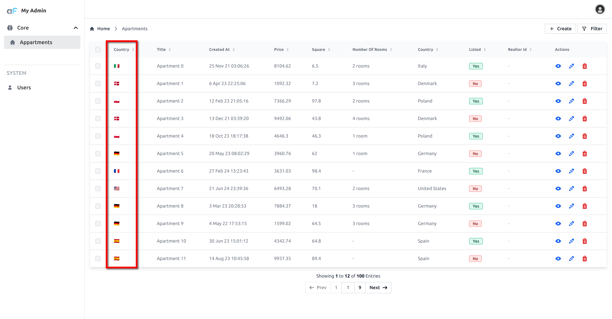

# Virtual columns

## Virtual column for show and list

Sometimes you need to visualize custom columns which do not exist in database. 
For doing this you can use `virtual` columns.

```diff title='./index.ts'
//diff-add
import { AdminForthDataTypes, AdminForthResourcePages } from 'adminforth/types/AdminForthConfig.js';

...
resourceId: 'aparts',
columns: [
  ...
//diff-add
  {
//diff-add
    name: 'Country Flag',
//diff-add
    label: 'Country Flag',
//diff-add
    type: AdminForthDataTypes.STRING,
//diff-add
    virtual: true,
//diff-add
    showIn: [AdminForthResourcePages.show, AdminForthResourcePages.list],
//diff-add
    components: {
//diff-add
      show: '@@/CountryFlag.vue',
//diff-add
      list: '@@/CountryFlag.vue',
//diff-add
    },
//diff-add
  }
  ...
]
```
 
 This field will be displayed in show and list views with custom component `CountryFlag.vue`.
 Create file `CountryFlag.vue` in `custom` folder of your project:
 
 ```html title="./custom/CountryFlag.vue"
 <template>
    {{ getFlagEmojiFromIso(record.country) }}
</template>
   
<script setup>
   const props = defineProps(['record']);
   
   function getFlagEmojiFromIso(iso) {
      return iso?.toUpperCase()?.replace(/./g, (char) => String.fromCodePoint(char.charCodeAt(0) + 127397));
   }
</script>
 ```

 To test component open some apartment for edit and change `description` field to `US New York`.
 Here is how it looks:
 


## Virtual columns for editing.

Another usecase of `virtual` columns is to add new fields in edit and create view. In the [Getting started](/docs/tutorial/01-gettingStarted.md) we used this feature to add `password` field to the `users` resource. 
Thing is that password itself can't be stored in the database, but instead their hash is stored. 
So we need to add `password` field to the `users` resource and make it `virtual` so it will not be stored in the database.

```ts title="./index.ts"
...
resourceId: 'users',
...
columns: [
  ...
  {
    name: 'password',
    virtual: true,  // field will not be persisted into db
    required: { create: true }, // make required only on create page
    editingNote: { edit: 'Leave empty to keep password unchanged' },
    minLength: 8,
    type: AdminForth.Types.STRING,
    showIn: ['create', 'edit'], // to show field only on create and edit pages
    masked: true, // to show stars in input field
  }
  ...
]
 ```

 Now to handle virtual `password` field we use hooks:
 

 ```ts title="./index.ts"
 hooks: {
    create: {
      beforeSave: async ({ record, adminUser, resource }) => {
        record.password_hash = await AdminForth.Utils.generatePasswordHash(record.password);
        return { ok:true, error: false };
      }
    },
    edit: {
      beforeSave: async ({ record, adminUser, resource}) => {
        if (record.password) {
          record.password_hash = await AdminForth.Utils.generatePasswordHash(record.password);
        }
        return { ok: true, error: false }
      },
    },
  }
```

Hook still has access to the virtual field `record.password`, and we use built-in AdminForth hasher to hash password and write it into
`password_hash` field which exists in database.

After hook is executed, `record.password` will be removed from the record since it is virtual, so password itself will not be saved to the database.

Another important point is that `hashed_password` field should never be passed to frontend due to security reasons.

To do it we have 2 options:

1) Do not list `password_hash` in the `columns` array of the resource. If AdminForth knows nothing about field
it will never pass this field to frontend.
2) Define `password_hash` but set `backendOnly`

```ts
{     
  name: 'password_hash',
  type: AdminForth.Types.STRING,
  showIn: [],
  backendOnly: true,  // will never go to frontend
}
```