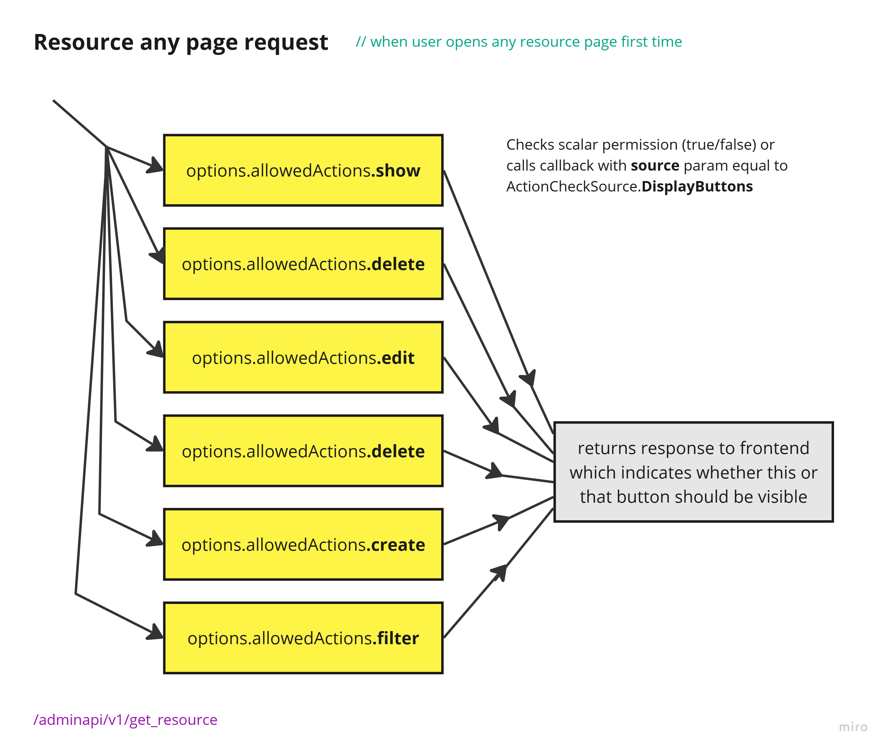

# Limiting actions access

As you might have noticed in diagrams from [adminforth hooks](./04-hooks.md) section of this tutorial, AdminForth checks `options.allowedActions` before executing any action. In this section we will show real-code examples of how to limit access to actions based on user role or record values.

Before we start it is worth to mention that callbacks or scalars defined in `allowedActions` are called/parsed not only before actual request but also before displaying buttons in the UI. So first time, when frontend loads any page of resource, it "calls" `allowedActions` to understand whether user has access to each function, and e.g. if it says that user can't delete record, AdminForth will not show delete icon in the UI:



As you can see allowedAction callbacks are called in parallel in async manner. However it is important to keep them fast and not to make any slow operations in them, to keep UI responsive.

## Statically disable some action on resource

You can use `options.allowedActions` on resource to limit access to the resource actions (list, show, create, edit, delete).

If you want to disable deletion of the resource records for all users:

```ts title="./resources/adminuser.ts"
{
  ...
  resourceId: 'adminuser',
  ...
//diff-add
  options: {
//diff-add
    allowedActions: {
//diff-add
      delete: false
//diff-add
    }
//diff-add
  }
}
```

## Disable full access to resource based on logged in user record or role

If you want to disable all actions to the resource for all users except users with role `superadmin`:

```ts title="./resources/adminuser.ts"
{
  ...
  resourceId: 'adminuser',
  ...
//diff-add
  options: {
//diff-add
    allowedActions: {
//diff-add
      all: async ({ adminUser }: { adminUser: AdminUser }): Promise<boolean> => {
//diff-add
        return adminUser.dbUser.role === 'superadmin';
//diff-add
      }
//diff-add
    }
//diff-add
  }
}
```


> ☝️ instead of reading role from user you can check permission using complex ACL/RBAC models with permissions stored in the database.
> However we recommend you to keep in mind that allowedActions callback is called on every request related to resource, so it should be fast.
> So try to minimize requests to database as much as possible.


> ☝️ This will not hide link to the resource in the menu, you should separately use [menuItem.visible](/docs/tutorial/Customization/menuConfiguration/#visibility-of-menu-items) to hide it.


## Disable only some action based on logged in user record or role

If you want to disable deletion of apartments for all users apart from users with role `superadmin`:

```ts title='./resources/apartments.ts'
//diff-add
import type { AdminUser } from  'adminforth';

{
  ...
  resourceId: 'aparts',
  ...
  options: {
//diff-add
    allowedActions: {
//diff-add
      delete: async ({ adminUser }: { adminUser: AdminUser }): Promise<boolean> => {
//diff-add
        return adminUser.dbUser.role === 'superadmin';
//diff-add
      }
//diff-add
    }
    ...
  }
}
```

### Reuse the same callback for multiple actions

Let's disable creating and editing of new users for all users apart from users with role `superadmin`, and at the same time disable deletion for all users:

```ts title="./resources/adminuser.ts"
//diff-add
import type { AdminUser } from  'adminforth';

//diff-add
async function canModifyUsers({ adminUser }: { adminUser: AdminUser }): Promise<boolean> {
//diff-add
  return adminUser.dbUser.role === 'superadmin';
//diff-add
}

...

{
  ...
  resourceId: 'adminuser',
  ...
  options: {
    allowedActions: {
//diff-add
      create: canModifyUsers,
//diff-add
      edit: canModifyUsers,
      delete: false
    }
    ...
  }
}
```


## Customizing the access control based on resource values

In more advanced cases you might need to check access based on record value. 
Generally it happens in multi-tenant applications where you need to check if user has access to the record based on some field value.


### Disable editing of the resource based on owner

For example, allow to edit apartments only if user is a realtor of the apartment (defined as realtor_id), otherwise return error
"You are not assigned to this apartment and can't edit it":

```ts title="./resources/apartments.ts"
import type { AdminUser } from  'adminforth';
import { ActionCheckSource } from  'adminforth';


async function canModifyApart({ adminUser, source, meta }: { adminUser: AdminUser, meta: any, source: ActionCheckSource }): Promise<boolean | string> {
  if (source === ActionCheckSource.DisplayButtons) {
    // if check is done for displaying button - we show button to everyone
    return true; 
  }
  const { oldRecord, newRecord } = meta;
  if (oldRecord.realtor_id !== adminUser.dbUser.id) {
    return "You are not assigned to this apartment and can't edit it";
  }
  if (newRecord.realtor_id !== oldRecord.realtor_id) {
    return "You can't change the owner of the apartment";
  }
  return true;
}


{
  ...
  resourceId: 'aparts',
  ...
  options: {
    allowedActions: {
      edit: canModifyApart,
    }
    ...
  }
}
```

### Disable deletion of the resource based on owner

If we need to allow only owner to delete the apartment:

```ts title="./resources/apartments.ts"
import type { AdminUser } from  'adminforth';

async function canDeleteApart({ adminUser, meta }: { adminUser: AdminUser, meta: any }): Promise<boolean | string> {
  const { record } = meta;
  if (record.realtor_id !== adminUser.dbUser.id) {
    return "You are not assigned to this apartment and can't delete it";
  }
  return true;
}

{
  ...
  resourceId: 'aparts',
  ...
  options: {
    allowedActions: {
      delete: canDeleteApart,
    }
    ...
  }
}
```

### Disable showing the resource based on owner

This one might sound pretty tricky. If Update and Delete callbacks in allowedActions were called with `meta` object which already had a records values,
here we need to fetch the record from the database to check if user is the owner of the record.
This is done because of architecture of AdminForth: `show` callback is called before action `list` or `show` hooks and requests.

```ts title="./resources/apartments.ts"
 allowedActions: {
    ...
    show: async ({adminUser, meta, source, adminforth}: any) => {
      if (source === 'showRequest' || source === 'editLoadRequest') {
        const record = await adminforth.resource('aparts').get(Filters.EQ('id', meta.pk));
        return record.realtor_id === adminUser.dbUser.id;
      }
      return true;
    },
 }
```

Please note that show callback is called not only when user visits show page (source will be `'showRequest'` during this check) but also
when user visits edit page (source will be `'editLoadRequest'`).

