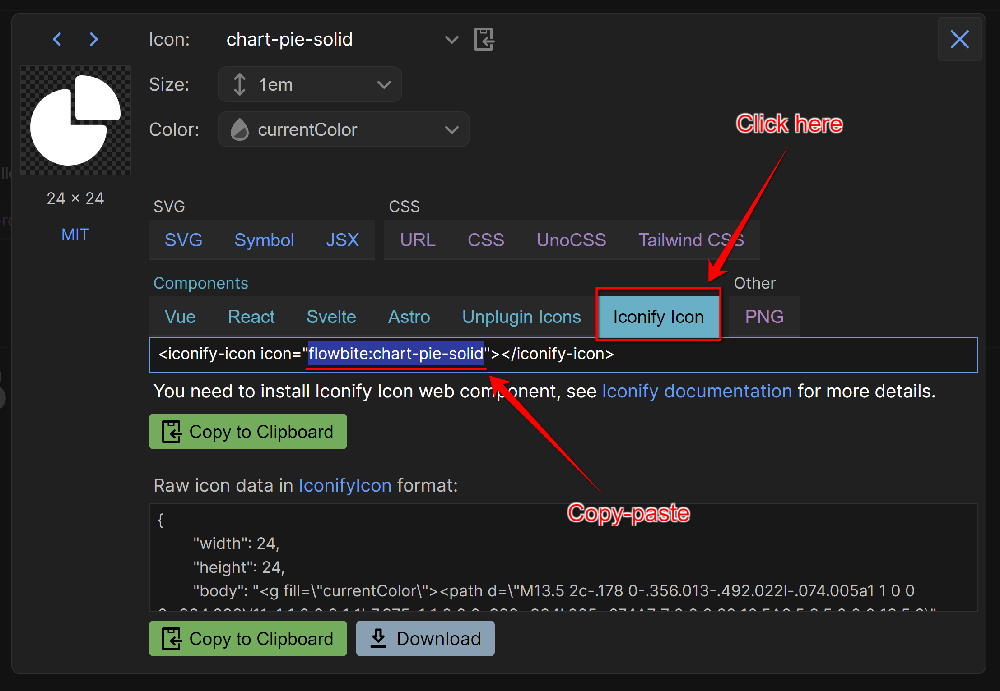

# Menu Configuration


## Icons

Adminforth uses [Iconify](https://iconify.design/) icons everywhere, including the menu. 

You can set an icon for each menu item using the `icon` field.

You can use any icon from the [Iconify Gallery](https://icon-sets.iconify.design/) in the format `<setname>:<icon>`. For example, `flowbite:brain-solid`.



> 👋 With deep respect to Alex Kozack who created great [iconify-prerendered](https://github.com/cawa-93/iconify-prerendered) MIT package used by AdminForth. It uses a scheduled job to prerender all icons from Iconify to icons font and then publish them to npm


## Grouping 

You can created a group of menu items with open or close:

E.g. create group "Blog" with Items who link to resource "posts" and "categories":
  
```ts title='./index.ts'
  {
    ...
    menu: {
      {
        label: 'Blog',
        icon: 'flowbite:brain-solid',
        open: true,
        children: [
          {
            label: 'Posts',
            icon: 'flowbite:book-open-outline',
            resourceId: 'posts',
          },
          {
            label: 'Categories',
            icon: 'flowbite:folder-duplicate-outline',
            resourceId: 'categories',
          },
        ],
      },
      {
        label: 'Users',
        icon: 'flowbite:folder-duplicate-outline',
        resourceId: 'users',
      },
    },
    ...
  }
```

If it is rare Group you can make it `open: false` so it would not take extra space in menu, but admin users will be able to open it by clicking on the group name.

## Gap

You can put one or several gaps between menu items:

```ts title='./index.ts'
{
  ...
  menu: [
    {
      label: 'Posts',
      icon: 'flowbite:book-open-outline',
      resourceId: 'posts',
    },
    {
      type: 'gap',
    },
    {
      type: 'gap',
    },
    {
      label: 'Categories',
      icon: 'flowbite:folder-duplicate-outline',
      resourceId: 'categories',
    },
  ],
  ...
}
```

## Divider

To split menu items with a line you can use a divider:

```ts title='./index.ts'
{
  ...
  menu: [
    {
      label: 'Posts',
      icon: 'flowbite:book-open-outline',
      resourceId: 'posts',
    },
    {
      type: 'divider',
    },
    {
      label: 'Categories',
      icon: 'flowbite:folder-duplicate-outline',
      resourceId: 'categories',
    },
  ]
  ...
}
```


## Heading

You can add a heading to the menu:

```ts title='./index.ts'
{
  ...
  menu: [
    {
      type: 'heading',
      label: 'Editings',
    },
    {
      label: 'Posts',
      icon: 'flowbite:book-open-outline',
      resourceId: 'posts',
    },
    {
      label: 'Categories',
      icon: 'flowbite:folder-duplicate-outline',
      resourceId: 'categories',
    },
  ],
  ...
}
```


## Badge

You can add a badge near the menu item title (e.g. to get count of unread messages). To do this, you need to add a `badge` field to the menu item configuration:

```ts title='./index.ts'
{
  ...
  menu: [
    {
      label: 'Posts',
      icon: 'flowbite:book-open-outline',
      resourceId: 'posts',
      badge: async (adminUser: AdminUser) => {
        return 10
      },
      badgeTooltip: 'New posts',  // explain user what this badge means
      ...
    },
  ],
  ...
}
```

Badge function is async, but all badges are loaded in "lazy" to not block the menu rendering.

### Refreshing the badges


Most times you need to refresh the badge from some backend API or hook. To do this you can do next:

1) Add `itemId` to menu item to identify it:

```ts title='./index.ts'
{
  ...
  menu: [
    {
      label: 'Posts',
      icon: 'flowbite:book-open-outline',
      resourceId: 'posts',
//diff-add
      itemId: 'postsMenuItem',
      badge: async (adminUser: AdminUser) => {
        return 10
      },
      badgeTooltip: 'Unverified posts',  // explain user what this badge means
      ...
    },
  ],
  ...
}
```

2) On backend point where you need to refresh the badge, you can publish a message to the websocket topic:

```ts title='./index.ts'
{
  resourceId: 'posts',
  table: 'posts',
  hooks: {
    edit: {
//diff-add
      afterSave: async ({ record, adminUser, resource, adminforth }) => {
//diff-add
        const newCount = await adminforth.resource('posts').count(Filters.EQ('verified', false));
//diff-add
        adminforth.websocket.publish(`/opentopic/update-menu-badge/postsMenuItem`, { badge: newCount });
//diff-add
        return { ok: true }
//diff-add
      }
    }
  }
}
```


> 👆 Please note that any `/opentopic/` publish can be listened by anyone without authorization. If count published in this channel might be
> a subject of security or privacy concerns, you should add [publish authorization](/docs/tutorial/Customization/websocket/#publish-authorization) to the topic.

More rare case when you need to refresh menu item from the frontend component. You can achieve this by calling the next method:

```typescript
window.adminforth.menu.refreshMenuBadges()
```

