# AdminForth Components Library

AFCL is a set of components which you can use as build blocks. 
AFCL allows to keep the design consistent with minimal efforts and build new pages faster.
AFCL components follow styling standard and respect theme colors.

## Button


<div class="split-screen" >
  <div >
```js
import { Button } from '@/afcl'
```

```html
<Button @click="doSmth" 
    :loader="false" class="w-full">
  Your button text
</Button>

<Button @click="doSmth" 
    :loader="true" class="w-full mt-4">
  Your button text
</Button>
```
</div>
<div>
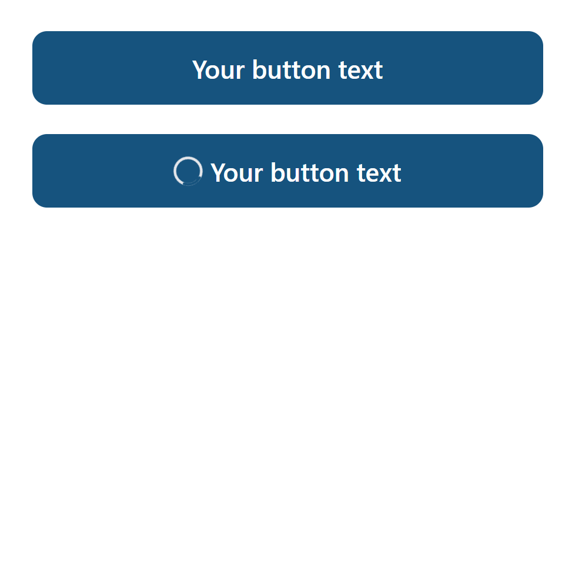
</div>
</div>


loader prop would show loader when it's true.


## Link


<div class="split-screen" >
  <div >

```js
import { Link } from '@/afcl'
```

```html
<Link to="/login">Go to login</Link>
```
</div>
<div>

</div>
</div>

## LinkButton

Looks like button but works like link. Uses `router-link` under the hood.


<div class="split-screen" >
  <div >
```js
import { LinkButton } from '@/afcl'
```

```html
<LinkButton to="/login">Go to login</LinkButton>
```
</div>
<div>

</div>
</div>

## Select

```js
import { Select } from '@/afcl'


const selected = ref(null)
```

### Single

<div class="split-screen" >
  <div >
```html
<Select
  class="w-full"
  :options="[
    {label: 'Last 7 days', value: '7'}, 
    {label: 'Last 30 days', value: '30'}, 
    {label: 'Last 90 days', value: '90'},
    {label: 'None', value: null}
  ]"
  v-model="selected"
></Select>
```
</div>
<div>

</div>
</div>

### Multiple

<div class="split-screen" >
  <div >
```html
<Select
  class="w-full"
  :options="[
    {label: 'Last 7 days', value: '7'}, 
    {label: 'Last 30 days', value: '30'}, 
    {label: 'Last 90 days', value: '90'},
    {label: 'None', value: null}
  ]"
  v-model="selected"
//diff-add
  multiple
></Select>
```
  </div>
  <div>
  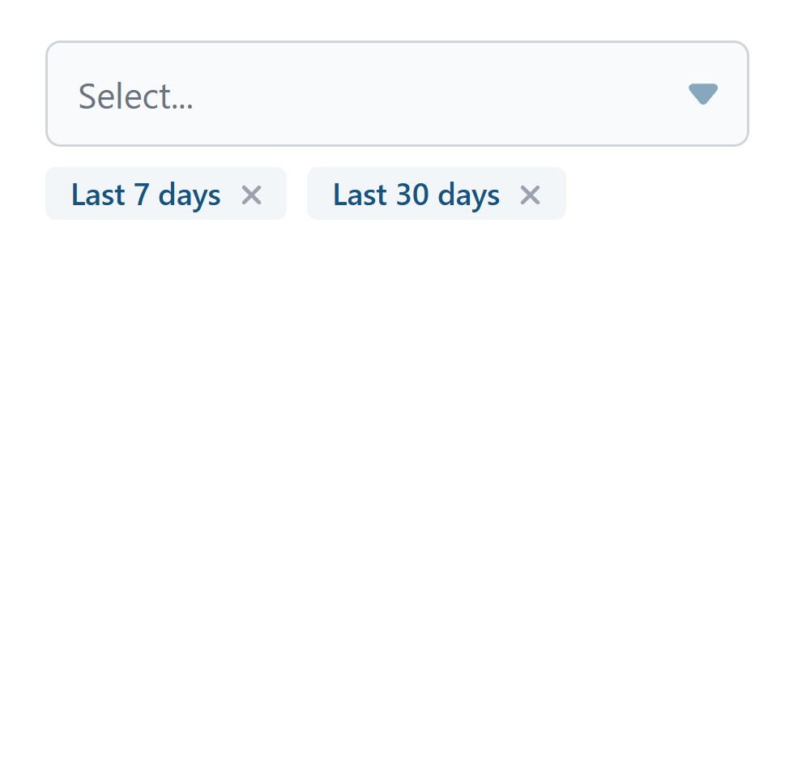
  </div>
</div>


### Custom slots for item

You can customize item and selected item using slots.

<div class="split-screen" >
  <div >
```html
<Select
  class="w-full"
  :options="[
    {label: 'Last 7 days', value: '7', records: 110},
    {label: 'Last 30 days', value: '30', records: 320},
    {label: 'Last 90 days', value: '90', records: 310},
    {label: 'None', value: null}
  ]"
  v-model="selected"
>
//diff-add
  <template #item="{option}">
//diff-add
    <div>
//diff-add
      <span>{{ option.label }}</span>
//diff-add
      <span class="ml-2 opacity-50">{{ option.records }} records</span>
//diff-add
    </div>
//diff-add
  </template>
//diff-add
  <template #selected-item="{option}">
//diff-add
    <span>{{ option.label }} 💫</span>
//diff-add
  </template>
</Select>
</div>
```
  </div>
  <div>
    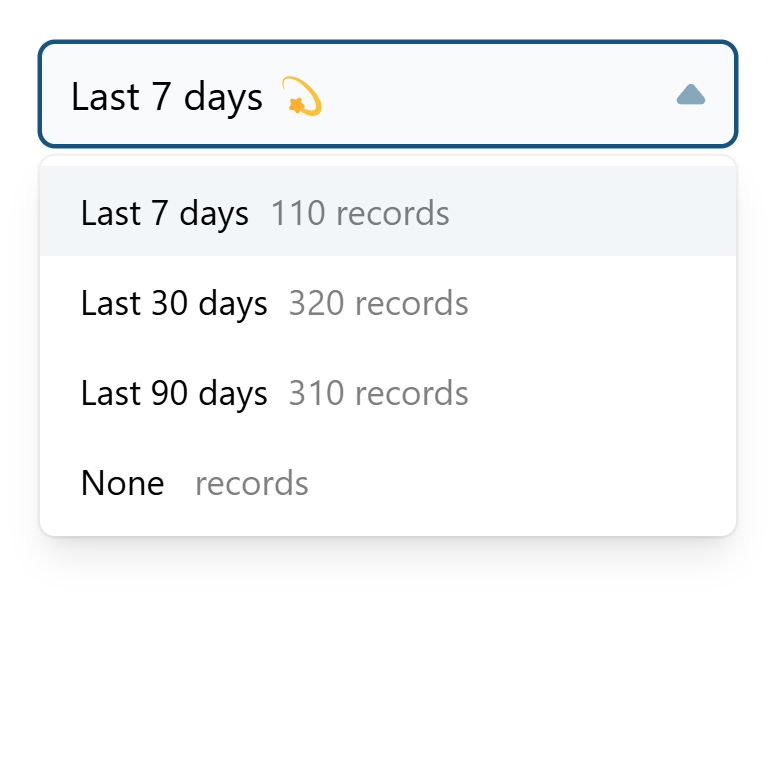
  </div>
</div>


### Extra item

You might need to put some extra item at bottom of list

<div class="split-screen" >
  <div >
```html
<Select
  class="w-full"
  :options="[
    {label: 'Last 7 days', value: '7'}, 
    {label: 'Last 30 days', value: '30'}, 
    {label: 'Last 90 days', value: '90'},
  ]"
  v-model="selected"
>
//diff-add
  <template #extra-item>
//diff-add
    <LinkButton to="/ranges">Manage ranges</LinkButton>
//diff-add
  </template>

</Select>
```
  </div>
  <div>
   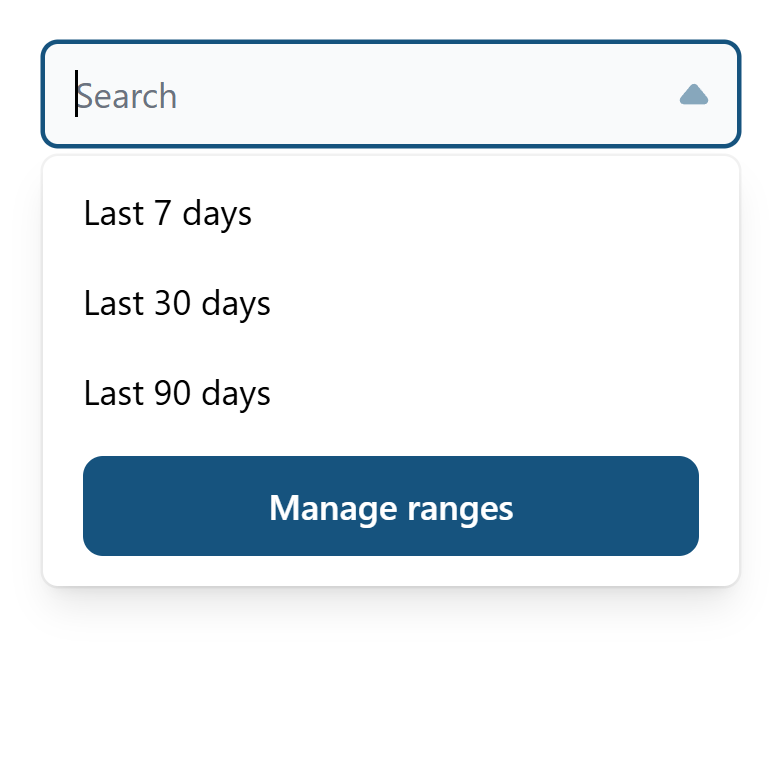
  </div>
</div>

## Input


<div class="split-screen" >
  <div >
```js
import { Input } from '@/afcl'
```

```html
<Input type="number" class="w-full">
  <template #suffix>
    USD
  </template>
</Input>
```
  </div>
  <div>
    
  </div>
</div>


## Tooltip
  
Wrap an element on which you would like to show a tooltip with the `Tooltip` component and add a `tooltip` slot to it.
  


<div class="split-screen" >
  <div >

```js
import { Tooltip } from '@/afcl'
```

```html
<Tooltip>
    <a :href="`https://google.com?q=adminforth`" target="_blank" >
        <IconCardSearch class="w-5 h-5 me-2"/>
    </a>

    <template #tooltip>
        Search for AdminForth
    </template>
</Tooltip>
```
  </div>
  <div>
    
  </div>
</div>


## VerticalTabs

Wrap each tab lable in tamplate with v-slot value `tab:TAB_ALIAS`. Wrap each tab content in tamplate with v-slot value `TAB_ALIAS`. `TAB_ALIAS` is a unique identifier for each tab here. Place all templates inside `VerticalTabs` component.

```js
import { VerticalTabs } from '@/afcl'
import { IconGridSolid, IconUserCircleSolid } from '@iconify-prerendered/vue-flowbite';
```

<div class="split-screen" >
  <div>
  ```html
  <VerticalTabs>
    <template #tab:Profile>
      <IconUserCircleSolid class="w-5 h-5 me-2"/>
      Profile
    </template>
    <template #tab:Dashboard>
      <IconGridSolid class="w-5 h-5 me-2"/>
      Board
    </template>
    <template #Profile>
      <h3 class="text-lg font-bold text-gray-900 dark:text-white mb-2">Profile Tab</h3>
      <p class="mb-2">This is some placeholder content the Profile tab's associated content</p>
    </template>
    <template #Dashboard>
      Dashboard Tab Content 
    </template>
  </VerticalTabs>
  ```
  </div>
  <div>
  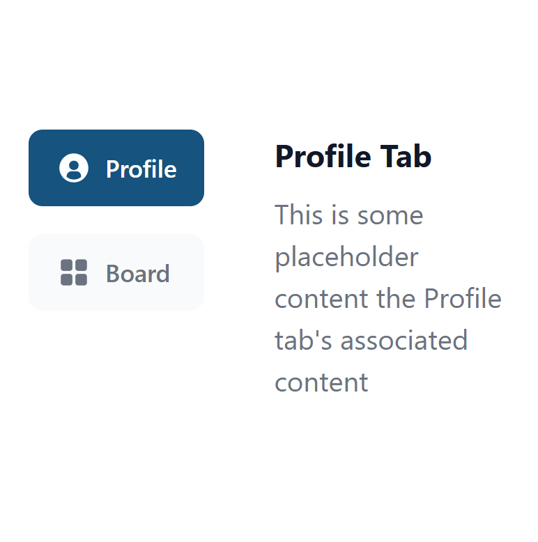
  </div>
</div>


## Checkbox

<div class="split-screen" >
  <div >

```ts
import { Checkbox } from '@/afcl'
const enable = ref(false)
```


```html
<Checkbox v-model="enable">
  Enable
</Checkbox>
```
  </div>
  <div>
  
  </div>
</div>


## Dropzone

```ts
import { Ref } from 'vue'
import { Dropzone } from '@/afcl'

const files: Ref<File[]> = ref([])

watch(files, (files) => {
  console.log('files selected', files);
  setTimeout(() => {
    // clear
    files.length = 0;
  }, 5000);
})
```

<div class="split-screen" >
  <div >


```html
<Dropzone
  :extensions="['.jpg', '.jpeg', '.png']"
  :maxSizeBytes="1024 * 1024 * 2"
  :multiple="false"
  v-model="files"
/>

```
  </div>
  <div>
    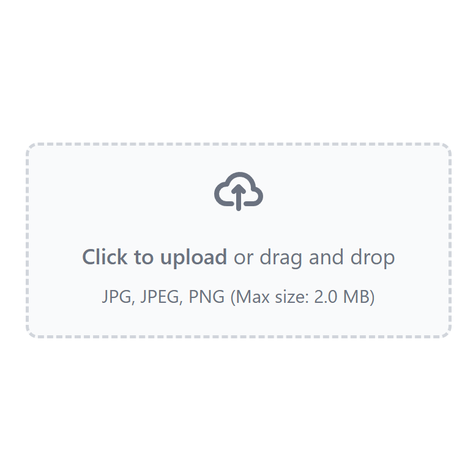
  </div>
</div>

## Table

<div class="split-screen" >
  <div >

```ts
import { Table } from '@/afcl'
```

```html
<Table
  :columns="[
    { label: 'Name', fieldName: 'name' },
    { label: 'Age', fieldName: 'age' },
    { label: 'Country', fieldName: 'country' },
  ]"
  :data="[
    { name: 'John', age: 30, country: 'US' },
    { name: 'Rick', age: 25, country: 'CA' },
    { name: 'Alice', age: 35, country: 'UK' },
    { name: 'Colin', age: 40, country: 'AU' },
  ]"
></Table>
```
  </div>
  <div>
    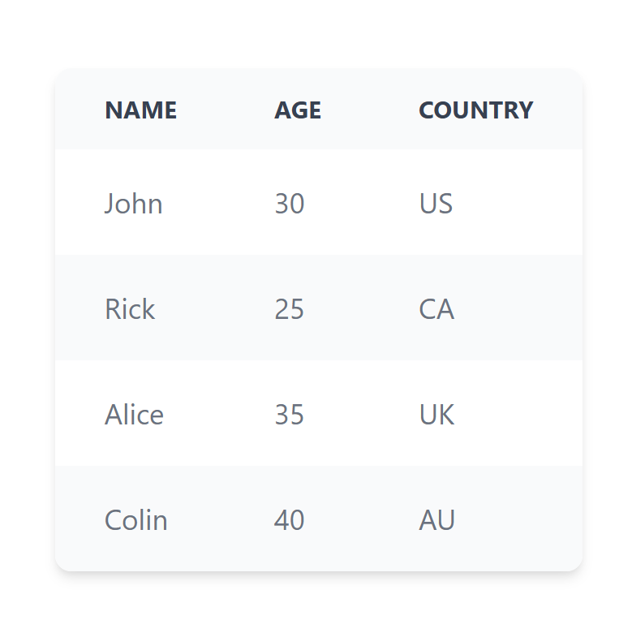
  </div>
</div>

### No even highlights

<div class="split-screen" >
  <div >

```html
<Table
  :columns="[
    { label: 'Name', fieldName: 'name' },
    { label: 'Age', fieldName: 'age' },
    { label: 'Country', fieldName: 'country' },
  ]"
  :data="[
    { name: 'John', age: 30, country: 'US' },
    { name: 'Rick', age: 25, country: 'CA' },
    { name: 'Alice', age: 35, country: 'UK' },
    { name: 'Colin', age: 40, country: 'AU' },
  ]"
//diff-add
  :evenHighlights="false"
></Table>
```
  </div>
  <div>
    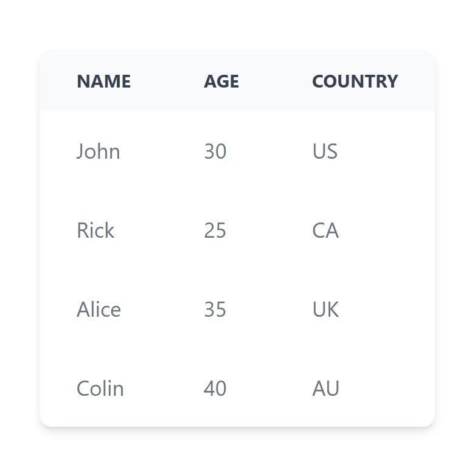
  </div>
</div>

### Custom cell

```ts
import { Table } from '@/afcl'
const isoFlagToEmoji = (iso) => iso.toUpperCase().replace(/./g, char => String.fromCodePoint(char.charCodeAt(0) + 127397))
```

<div class="split-screen" >
  <div >

```html
<Table
  :columns="[
    { label: 'Name', fieldName: 'name' },
    { label: 'Age', fieldName: 'age' },
    { label: 'Country', fieldName: 'country' },
  ]"
  :data="[
    { name: 'John', age: 30, country: 'US' },
    { name: 'Rick', age: 25, country: 'CA' },
    { name: 'Alice', age: 35, country: 'BR' },
    { name: 'Colin', age: 40, country: 'AU' },
  ]"
>
//diff-add
  <template #cell:country="{item}">
//diff-add
    {{ isoFlagToEmoji(item.country) }}
//diff-add
  </template>
</Table>
```
  </div>
  <div>
    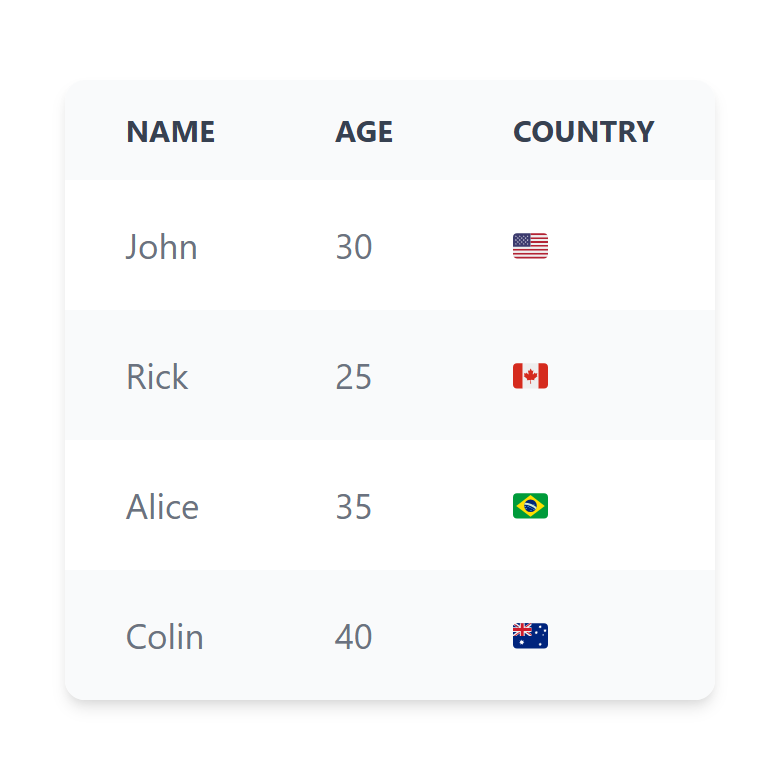
  </div>
</div>

### Custom header

<div class="split-screen" >
  <div >
```html
        <Table
  :columns="[
    { label: 'Name', fieldName: 'name' },
    { label: 'Age', fieldName: 'age' },
    { label: 'Country', fieldName: 'country' },
  ]"
  :data="[
    { name: 'John', age: 30, country: 'US' },
    { name: 'Rick', age: 25, country: 'CA' },
    { name: 'Alice', age: 35, country: 'BR' },
    { name: 'Colin', age: 40, country: 'AU' },
  ]"
>
//diff-add
<template #header:country>
//diff-add
    🌍 Geo
//diff-add
</template>
</Table>
```
  </div>
  <div>
    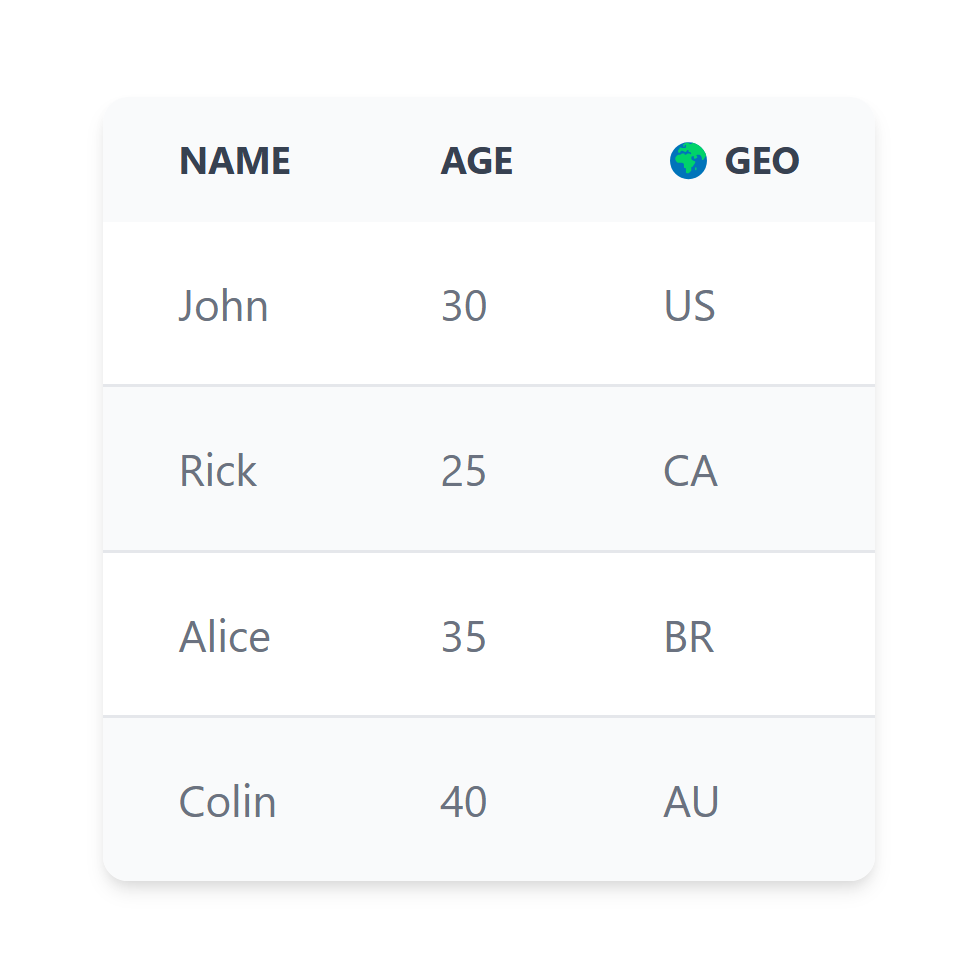
  </div>
</div>


## Pagination

Table provides front-end side pagination. You can set `pageSize` (default is 10) to set how many rows to show per page.
If there is less then `pageSize` rows, pagination will not be shown.

<div class="split-screen" >
  <div >

```html
<Table
  :columns="[
    { label: 'Name', fieldName: 'name' },
    { label: 'Age', fieldName: 'age' },
    { label: 'Country', fieldName: 'country' },
  ]"
  :data="[
    { name: 'John', age: 30, country: 'US' },
    { name: 'Rick', age: 25, country: 'CA' },
    { name: 'Alice', age: 35, country: 'BR' },
    { name: 'Colin', age: 40, country: 'AU' },
  ]"
//diff-add
  :pageSize="3"
>
</Table>
```
  </div>
  <div>
  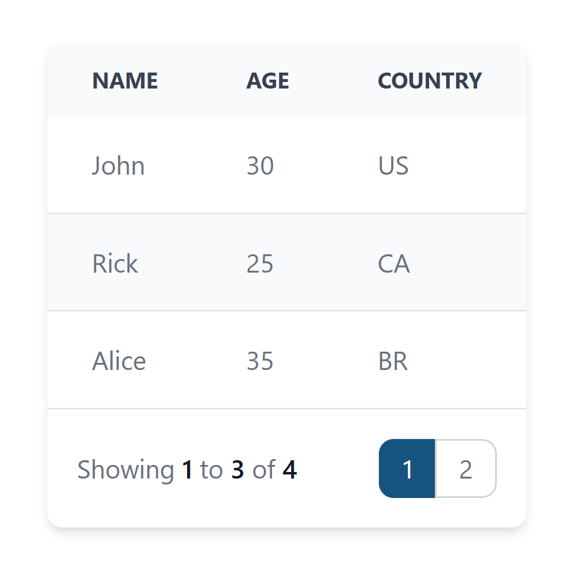
  </div>
</div>


## Bar Chart

Under the hood AdminForth uses MIT-licensed [ApexCharts](https://apexcharts.com/). It has very rich variety of options, you can pass
any of native settings to `options` prop. Here we will only show some basics.


<div class="split-screen" >
  <div >
```html
<BarChart
  :data="[
    { count: 1, x: '02 Jun 2025'}, 
    { count: 5, x: '03 Jun 2025'}, 
    { count: 3, x: '04 Jun 2025'}, 
    { count: 4, x: '05 Jun 2025'}, 
    { count: 2, x: '06 Jun 2025'}, 
  ]"
  :series="[{
    name: $t('Added apartments'),
    fieldName: 'count',
    color: '#4E79A7',
  }]"
  :options="{
    chart: {
      height: 250,
    },
  }"
/>
```
  </div>
  <div>
    
  </div>

</div>


### Y-axis labels

<div class="split-screen" >

  <div >
```html
<BarChart
  :data="[
    { count: 1, x: '02 Jun 2025'}, 
    { count: 5, x: '03 Jun 2025'}, 
    { count: 3, x: '04 Jun 2025'}, 
    { count: 4, x: '05 Jun 2025'}, 
    { count: 2, x: '06 Jun 2025'}, 
  ]"
  :series="[{
    name: $t('Added apartments'),
    fieldName: 'count',
    color: '#4E79A7',
  }]"
  :options="{
    chart: {
      height: 250,
    },
//diff-add
    yaxis: {
//diff-add
      stepSize: 1, // needed if your data is integer
//diff-add
      labels: {
//diff-add
        show: true,
//diff-add
        style: {
//diff-add
          fontFamily: 'Inter, sans-serif',
//diff-add
          cssClass: 'text-xs font-normal fill-gray-500 dark:fill-gray-400'
//diff-add
        }
//diff-add
      }
//diff-add
    }
  }"
/>
```
  </div>
  <div>
  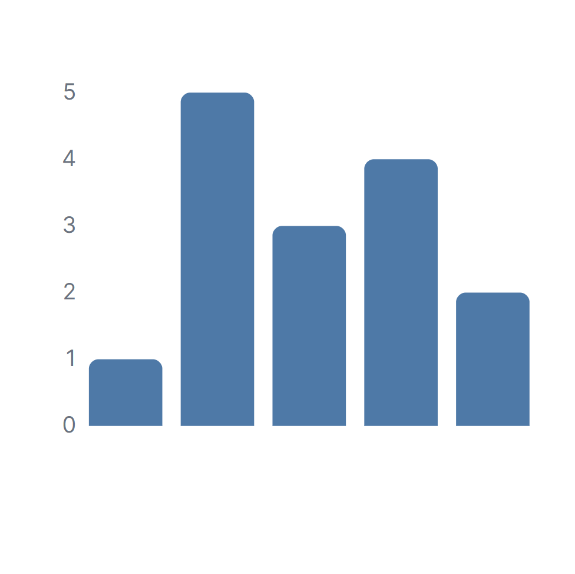
  </div>
</div>


### X-axis labels and formatting labels

<div class="split-screen" >

  <div >
```html
<BarChart
  :data="[
    { count: 1, x: '02 Jun 2025'}, 
    { count: 5, x: '03 Jun 2025'}, 
    { count: 3, x: '04 Jun 2025'}, 
    { count: 4, x: '05 Jun 2025'}, 
    { count: 2, x: '06 Jun 2025'}, 
  ]"
  :series="[{
    name: $t('Added apartments'),
    fieldName: 'count',
    color: '#4E79A7',
  }]"
  :options="{
    chart: {
      height: 250,
    },
//diff-add
    xaxis: {
//diff-add
      labels: {
//diff-add
        show: true,
//diff-add
        formatter: function (value) {
//diff-add
          return dayjs(value).format('DD MMM');
//diff-add
        },
//diff-add
        style: {
//diff-add
          fontFamily: 'Inter, sans-serif',
//diff-add
          cssClass: 'text-xs font-normal fill-gray-500 dark:fill-gray-400'
//diff-add
        }
//diff-add
      }
    }
  }"
/>
```
  </div>
  <div>
  
  </div>
</div>

### Grid

<div class="split-screen" >

  <div >
```html
<BarChart
  :data="[
    { count: 1, x: '02 Jun 2025'}, 
    { count: 5, x: '03 Jun 2025'}, 
    { count: 3, x: '04 Jun 2025'}, 
    { count: 4, x: '05 Jun 2025'}, 
    { count: 2, x: '06 Jun 2025'}, 
  ]"
  :series="[{
    name: $t('Added apartments'),
    fieldName: 'count',
    color: '#4E79A7',
  }]"
  :options="{
    chart: {
      height: 250,
    },
//diff-add
    grid: {
//diff-add
      show: true,
//diff-add
      borderColor: 'rgba(0, 0, 0, 0.1)',
//diff-add
      strokeDashArray: 4, 
//diff-add
      position: 'back',
//diff-add
      xaxis: {
//diff-add
        lines: {
//diff-add
          show: true
//diff-add
        }
//diff-add
      },
//diff-add
      yaxis: {  
//diff-add
        lines: {
//diff-add
          show: true
//diff-add
        }
//diff-add
      }
//diff-add
    }
  }"
/>
```
  </div>
  <div>
  
  </div>
</div>

### Data labels

<div class="split-screen" >

  <div >
```html
<BarChart
  :data="[
    { count: 1, x: '02 Jun 2025'}, 
    { count: 5, x: '03 Jun 2025'}, 
    { count: 3, x: '04 Jun 2025'}, 
    { count: 4, x: '05 Jun 2025'}, 
    { count: 2, x: '06 Jun 2025'}, 
  ]"
  :series="[{
    name: $t('Added apartments'),
    fieldName: 'count',
    color: '#4E79A7',
  }]"
  :options="{
    chart: {
      height: 250,
    },
//diff-add
    dataLabels: {
//diff-add
      formatter: function (value) {
//diff-add
        return `⬆️ ${value}`;
//diff-add
      },
//diff-add
      enabled: true,
//diff-add
      style: {
//diff-add
        fontSize: '12px',
//diff-add
        fontFamily: 'Inter, sans-serif',
//diff-add
      }
//diff-add
    }
  }"
/>
```
  </div>
  <div>
  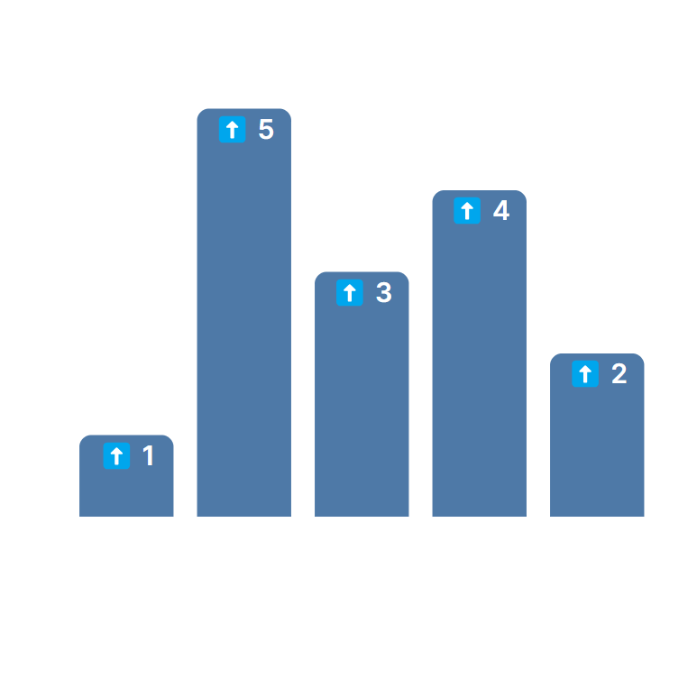
  </div>
</div>

### Stacked bars and legend

<div class="split-screen" >

  <div >
```html
<BarChart
  :data="[
    { countCars: 2, countBikes: 3, x: '02 Jun 2025'}, 
    { countCars: 5, countBikes: 1, x: '03 Jun 2025'}, 
    { countCars: 3, countBikes: 4, x: '04 Jun 2025'}, 
    { countCars: 4, countBikes: 2, x: '05 Jun 2025'}, 
    { countCars: 2, countBikes: 3, x: '06 Jun 2025'},
  ]"
  :series="[
    {
      name: $t('Cars'),
      fieldName: 'countCars',
      color: '#4E79A7',
    },
    {
      name: $t('Bikes'),
      fieldName: 'countBikes',
      color: '#F28E2B',
    }
  ]"
  :options="{
    chart: {
      height: 250,
//diff-add
      stacked: true,
    },
//diff-add
    legend: {
//diff-add
      show: true,
//diff-add
    },
  }"
/>
```
  </div>
  <div>
  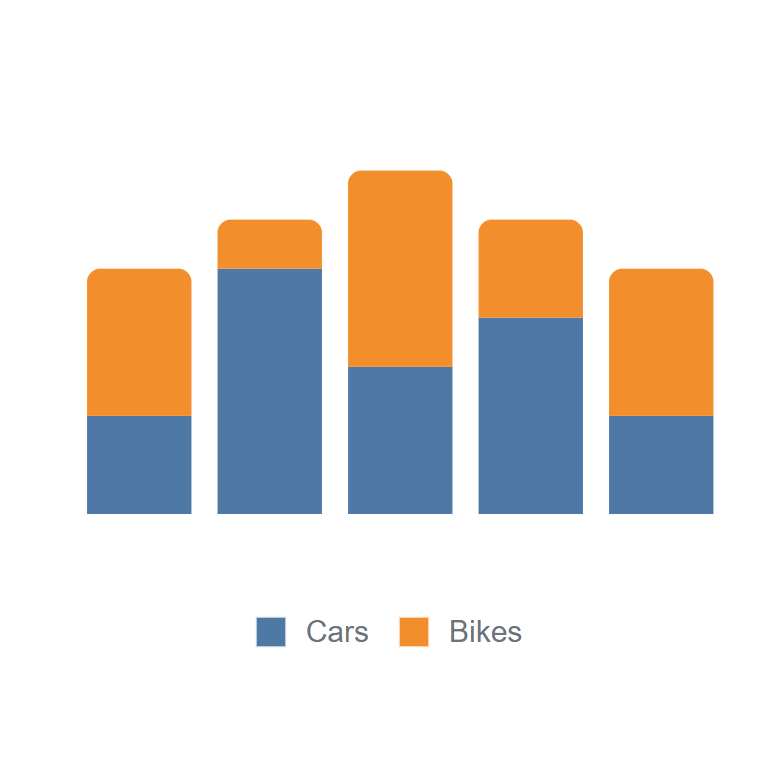
  </div>
</div>

### Horizontal bars

<div class="split-screen" >

  <div >
```html
<BarChart
  :data="[
    { countCars: 2, countBikes: 3, x: '02 Jun 2025'}, 
    { countCars: 5, countBikes: 1, x: '03 Jun 2025'}, 
    { countCars: 3, countBikes: 4, x: '04 Jun 2025'}, 
    { countCars: 4, countBikes: 2, x: '05 Jun 2025'}, 
    { countCars: 2, countBikes: 3, x: '06 Jun 2025'},
  ]"
  :series="[
    {
      name: $t('Cars'),
      fieldName: 'countCars',
      color: '#4E79A7',
    },
    {
      name: $t('Bikes'),
      fieldName: 'countBikes',
      color: '#F28E2B',
    }
  ]"
  :options="{
    chart: {
      height: 250,
      type: 'bar',
    },
//diff-add
    plotOptions: {
//diff-add
      bar: {
//diff-add
        horizontal: true,
//diff-add
      }
//diff-add
    },
    legend: {
      show: true,
    },
  }"
/>
```
  </div>
  <div>
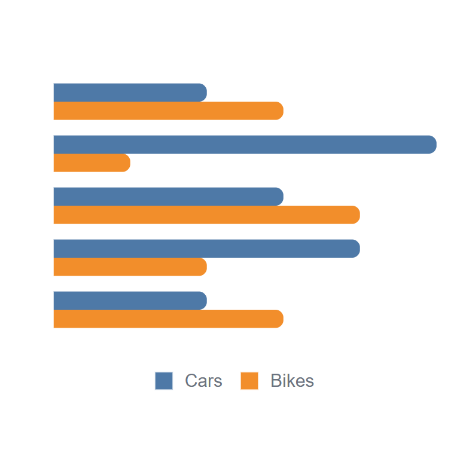
  </div>
</div>

## Area Chart

```ts
import { AreaChart } from '@/afcl'
```

<div class="split-screen" >

  <div >
```html
<AreaChart
  :data="[
    { count: 1, x: '02 Jun 2025'}, 
    { count: 5, x: '03 Jun 2025'}, 
    { count: 3, x: '04 Jun 2025'}, 
    { count: 4, x: '05 Jun 2025'}, 
    { count: 2, x: '06 Jun 2025'}, 
  ]"
  :series="[{
    name: $t('Added apartments'),
    fieldName: 'count',
    color: '#4E79A7',
  }]"
  :options="{
    chart: {
      height: 250,
    },
  }"
/>
</div>
  <div>
  
  </div>
</div>

### Multiple lines

<div class="split-screen" >

  <div >
```html
<AreaChart
  :data="[
    { countCars: 2, countBikes: 3, x: '02 Jun 2025'}, 
    { countCars: 5, countBikes: 1, x: '03 Jun 2025'}, 
    { countCars: 3, countBikes: 4, x: '04 Jun 2025'}, 
    { countCars: 4, countBikes: 2, x: '05 Jun 2025'}, 
    { countCars: 2, countBikes: 3, x: '06 Jun 2025'},
  ]"
  :series="[
    {
      name: $t('Cars'),
      fieldName: 'countCars',
      color: '#4E79A7',
    },
    {
      name: $t('Bikes'),
      fieldName: 'countBikes',
      color: '#F28E2B',
    }
  ]"
  :options="{
    chart: {
      height: 250,
    },
  }"
/>
```
  </div>
  <div>
  
  </div>
</div>

### Stacked area

<div class="split-screen" >

  <div >
```html
<AreaChart
  :data="[
    { countCars: 2, countBikes: 3, x: '02 Jun 2025'}, 
    { countCars: 5, countBikes: 1, x: '03 Jun 2025'}, 
    { countCars: 3, countBikes: 4, x: '04 Jun 2025'}, 
    { countCars: 4, countBikes: 2, x: '05 Jun 2025'}, 
    { countCars: 2, countBikes: 3, x: '06 Jun 2025'},
  ]"
  :series="[
    {
      name: $t('Cars'),
      fieldName: 'countCars',
      color: '#4E79A7',
    },
    {
      name: $t('Bikes'),
      fieldName: 'countBikes',
      color: '#F28E2B',
    }
  ]"
  :options="{
    chart: {
      height: 250,
//diff-add
      stacked: true,
    },
  }"
/>
```
  </div>
  <div>
  
  </div>
</div>

### Data labels

<div class="split-screen" >

  <div >
```html
<AreaChart
  :data="[
    { count: 2, x: '02 Jun 2025'}, 
    { count: 5, x: '03 Jun 2025'}, 
    { count: 3, x: '04 Jun 2025'}, 
    { count: 4, x: '05 Jun 2025'}, 
    { count: 2, x: '06 Jun 2025'},
  ]"
  :series="[
    {
      name: $t('Cars'),
      fieldName: 'count',
      color: '#4E79A7',
    },
  ]"
  :options="{
    chart: {
      height: 250,
    },
    dataLabels: {
      enabled: true,
      style: {
        fontSize: '12px',
        fontFamily: 'Inter, sans-serif',
      }
    },
    grid: {
      padding: {
        left: 10, // to fit the labels
        right: 10,
      },
    },
  }"
/>
```
  </div>
  <div>
  
  </div>
</div>

### Grid, x-axis and y-axis labels

See [Bar Chart](#bar-chart) for details, the config is the same.


## Pie Chart

```ts
import { PieChart } from '@/afcl'
```

### Basic

<div class="split-screen" >

  <div >
```html
<PieChart
  :data="[
    { amount: 5, label: 'Cars'},
    { amount: 3, label: 'Bikes'},
    { amount: 2, label: 'Trucks'},
    { amount: 1, label: 'Boats'},
  ]"
  :options="{
    chart: {
      height: 250,
    },
  }"
/>
```
  </div>
  <div>
  
  </div>
</div>

### Pie with data labels

<div class="split-screen" >

  <div >
```html
<PieChart
  :data="[
    { amount: 5, label: 'Cars'},
    { amount: 3, label: 'Bikes'},
    { amount: 2, label: 'Trucks'},
    { amount: 1, label: 'Boats'},
  ]"
  :options="{
    chart: {
      height: 250,
    },
//diff-add
    dataLabels: {
//diff-add
      enabled: true,
//diff-add
    },
//diff-add
    plotOptions: {
//diff-add
      pie: {
//diff-add
        dataLabels: {
//diff-add
          offset: -10, // Moves labels closer to or further from the slices
//diff-add
          minAngleToShowLabel: 10, // Ensures that small slices don’t show labels
//diff-add
        },
//diff-add
        expandOnClick: true,
// diff-add
      },
// diff-add
    },
  }"
/>
```
  </div>
  <div>
  
  </div>
</div>


### Donut Chart


<div class="split-screen" >

  <div >
```html
<PieChart
  :data="[
    { amount: 5, label: 'Cars'},
    { amount: 3, label: 'Bikes'},
    { amount: 2, label: 'Trucks'},
    { amount: 1, label: 'Boats'},
  ]"
  :options="{
    chart: {
      height: 250,
  //diff-add
      type: 'donut',
    },
  }"
/>
```
  </div>
  <div>
  
  </div>
</div>

### Fill donut with total info

<div class="split-screen" >

  <div >
```html
<PieChart
  :data="[
    { amount: 5, label: 'Cars'},
    { amount: 3, label: 'Bikes'},
    { amount: 2, label: 'Trucks'},
    { amount: 1, label: 'Boats'},
  ]"
  :options="{
    chart: {
      height: 250,
      type: 'donut',
    },
//diff-add
    plotOptions: {
//diff-add
      pie: {
//diff-add
        donut: {
//diff-add
          labels: {
//diff-add
            total: {
//diff-add
              show: true,
//diff-add
              label: $t('Total wheels'),
//diff-add
              formatter: () => `11`,
//diff-add
            },
//diff-add
          },
//diff-add
        },
//diff-add
      },
    },
  }"
/>
```
  </div>
  <div>
  
  </div>
</div>

### Radial bar chart

<div class="split-screen" >

  <div >
```html
  <PieChart
  :data="[
    { amount: 80, label: 'Cars'},
    { amount: 50, label: 'Bikes'},
    { amount: 30, label: 'Trucks'},
    { amount: 70, label: 'Boats'},
  ]"
  :options="{
    chart: {
//diff-add
      height: '300px',
//diff-add
      width: '100%',
//diff-add
      type: 'radialBar',
//diff-add
      sparkline: {
//diff-add
        enabled: true,
//diff-add
      },
//diff-add
    },
//diff-add
    plotOptions: {
//diff-add
      radialBar: {
//diff-add
        track: {
//diff-add
          background: '#E5E7EB',
//diff-add
        },
//diff-add
        dataLabels: {
//diff-add
          name: {
//diff-add
            offsetY: -10
//diff-add
          },
//diff-add
          value: {
//diff-add
            offsetY: 2,
//diff-add
          }
//diff-add
        },
//diff-add
        hollow: {
//diff-add
          margin: 0,
//diff-add
          size: '32%',
//diff-add
        }
//diff-add
      },
//diff-add
    },
//diff-add
    legend: {
//diff-add
      show: true,
//diff-add
      position: 'bottom',
//diff-add
    },
    
  }"
/>
```
  </div>
  <div>
  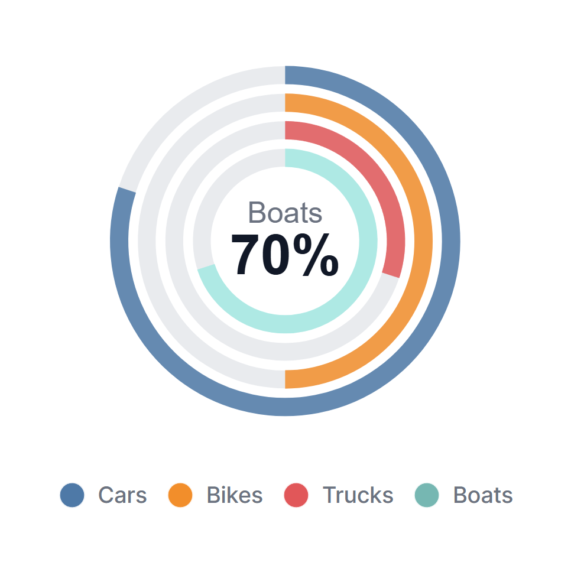
  </div>
</div>


