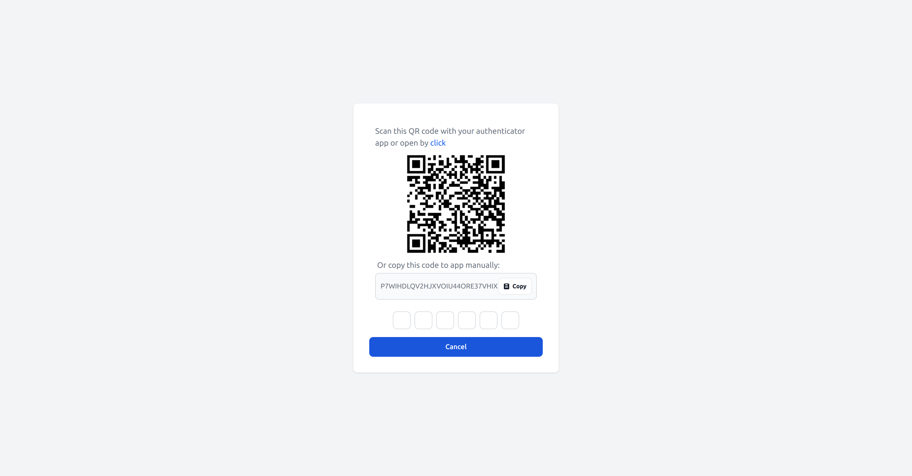

# Two-Factor Authentication Plugin

The Two-Factor Authentication Plugin provides an additional layer of security to the application by requiring users to provide a second form of authentication in addition to their password. This plugin supports  authenticator apps.

## Installation


```
npm i @adminforth/two-factors-auth --save
```

Plugin is already installed into adminforth, to import:
    
```ts title="/users.ts"
import TwoFactorsAuthPlugin from '@adminforth/two-factors-auth';
```

Plugin required some additional setup, to make it work properly. It should be added to the resource auth resource. In our example we will add it to the user resource .

```ts title='./schema.prisma'
model users {
  id            String     @id
  created_at    DateTime 
  email         String   @unique
  role          String     
  password_hash String
//diff-add
  secret2fa     String?
}
```

Then:

```bash
npx --yes prisma migrate dev --name init
```

And add it to `users.ts`
```ts tittle="./resources/users.ts"
{
    table: 'users',
//diff-add
    plugins: [
//diff-add
        new TwoFactorsAuthPlugin ({ twoFaSecretFieldName: 'secret2fa' }),
//diff-add
    ],
    columns: [
        ...
//diff-add
        {
//diff-add
            name: 'secret2fa',
//diff-add
            showIn: [],
//diff-add
            backendOnly: true,
//diff-add
        }
    ],
  }
```

Thats it! Two-Factor Authentication is now enabled: 


## Disabling Two-Factor Authentication locally

If it is not convenient to enter the code every time you log in during local development, you can disable Two-Factor Authentication 
for the dev environment using `usersFilterToApply` option.

```ts title='./index.ts'

    plugins: [
        new TwoFactorsAuthPlugin ({ 
          twoFaSecretFieldName: 'secret2fa',
//diff-add
          usersFilterToApply: (adminUser: AdminUser) => {
//diff-add
            // if this method returns true, 2FA will be enforced for this user, if returns false - 2FA will be disabled
//diff-add
            if (process.env.NODE_ENV === 'development') {
//diff-add
              return false;
//diff-add
            }
//diff-add
            return true;
//diff-add
          },
        }),
    ],
```


## Select which users should use Two-Factor Authentication

By default plugin enforces Two-Factor Authentication for all users. 

If you wish to enforce 2FA only for specific users, you can again use `usersFilterToApply` option:

```ts title='./users.ts'
  usersFilterToApply: (adminUser: AdminUser) => {
    // disable 2FA for users which email is 'adminforth' or 'adminguest'
    return !(['adminforth', 'adminguest'].includes(adminUser.dbUser.email));
  },
```
 
You can even add a boolean column to the user table to store whether the user should use 2FA or not:

```ts title='./users.ts'
{
    resourceId: 'users',
    ...
    columns: [
        ...
        {
            name: 'use2fa',
        }
        ...
    ],
    options: {
      allowedActions: {
        delete: ({ adminUser }: { adminUser: AdminUser }) => {
          // only superadmin can delete users
          return adminUser.dbUser.role === 'superadmin';
        },
        create: ({ adminUser }: { adminUser: AdminUser }) => {
          // only superadmin can create users
          return adminUser.dbUser.role === 'superadmin';
        },
        edit: ({ adminUser, meta }: { adminUser: AdminUser }) => {
          // user can modify only his own record
          const { oldRecord } = meta;
          return adminUser.dbUser.id === oldRecord.id;
        },
      }
    },
    plugins: [
        new TwoFactorsAuthPlugin ({ 
          twoFaSecretFieldName: 'secret2fa',
          usersFilterToApply: (adminUser: AdminUser) => {
            return adminUser.dbUser.use2fa;
          },
        }),
    ],
}
```

## Allow Specific Users to Skip Two-Factor Authentication Setup

By default, all users are required to setup Two-Factor Authentication.

If you want to allow specific users to skip the 2FA setup, you can use the `usersFilterToAllowSkipSetup` option:

```ts title='./users.ts'
...
plugins: [
        new TwoFactorsAuthPlugin ({ 
          twoFaSecretFieldName: 'secret2fa',
          ...
        //diff-add
          usersFilterToAllowSkipSetup: (adminUser: AdminUser) => {
            //diff-add
            // allow skip setup 2FA for users which email is 'adminforth' or 'adminguest'
            //diff-add
            return !(['adminforth', 'adminguest'].includes(adminUser.dbUser.email));
            //diff-add
          },
        }),
],
...
```