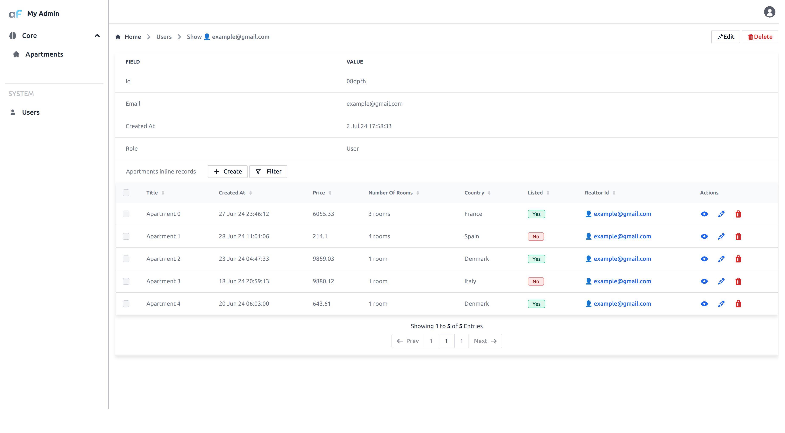

Foreign inline list plugin allows to display a list (table) of items from a foreign table in the show view.

## Usage


Import plugin:

```bash
npm i @adminforth/foreign-inline-list --save
```

```ts title="./resources/users.ts"
import ForeignInlineListPlugin from '@adminforth/foreign-inline-list';
import { AdminForthResource, AdminForthResourceColumn } from 'adminforth';
```


In [Getting Started](<../001-gettingStarted.md>) we created a `'aparts'` resource which has a field `'realtor_id'`.
This field refers to record from `'users'` resource. This means that we can display a list of apartments in the user's show view.

Add to your `'users'` resource configuration the plugin instance:


```ts title="./resources/users.ts"
{ 
    ...
    resourceId: 'users',
    ...
//diff-add
    plugins: [
//diff-add
      new ForeignInlineListPlugin({
//diff-add
        foreignResourceId: 'aparts',
//diff-add
        modifyTableResourceConfig: (resourceConfig: AdminForthResource) => {
//diff-add
          // hide column 'square_meter' from both 'list' and 'filter'
//diff-add
          const column = resourceConfig.columns.find((c: AdminForthResourceColumn) => c.name === 'square_meter')!.showIn = { all: false };
//diff-add
          resourceConfig.options!.listPageSize = 1;
//diff-add
          // feel free to console.log and edit resourceConfig as you need
//diff-add
        },
//diff-add
      }),
//diff-add
    ],
}
```

You can use `modifyTableResourceConfig` callback to modify what columns to show in the list and filter of the foreign table.



<!-- See [API Reference](/docs/api/plugins/foreign-inline-list/types/type-aliases/PluginOptions) for more all options. -->