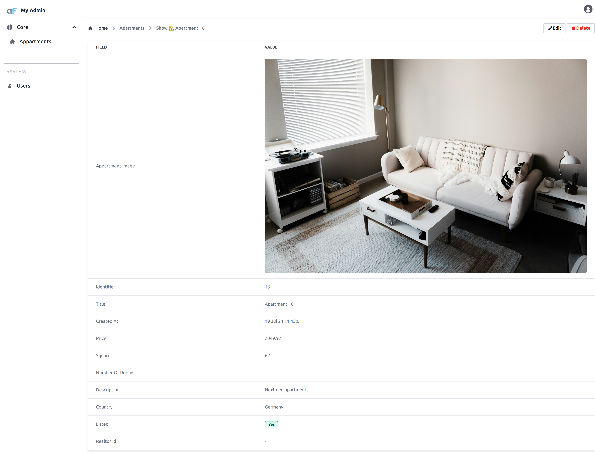
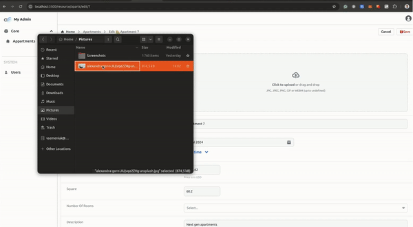

# Upload

This plugin allows you to upload files to Amazon S3 bucket.

## Installation

```
npm i @adminforth/upload --save
```

## S3

1. Go to https://aws.amazon.com and login.
2. Go to Services -> S3 and create a bucket. Put in bucket name e.g. `my-reality-bucket`. 
Leave all settings unchanged (ACL Disabled, Block all public access - checked)
3. Go to bucket settings, Permissions, scroll down to Cross-origin resource sharing (CORS) and put in the following configuration:

```json
[
    {
        "AllowedHeaders": [
            "*"
        ],
        "AllowedMethods": [
            "PUT"
        ],
        "AllowedOrigins": [
            "http://localhost:3500"
        ],
        "ExposeHeaders": []
    }
]
```

> 🫨 In AllowedOrigins add all your domains. For example if you will searve adming on `https://example.com/admin` you should add 
> `"https://example.com"` to AllowedOrigins:
>
> ```json
> [
>      "https://example.com",
>      "http://localhost:3500"
> ]
> ```
> Every character matters, so don't forget to add `http://` or `https://`!

4. Go to Services -> IAM and create a new user. Put in user name e.g. `my-reality-user`.
5. Attach existing policies directly -> `AmazonS3FullAccess`. Go to your user -> `Add permissions` -> `Attach policies directly` -> `AmazonS3FullAccess`
6. Go to Security credentials and create a new access key. Save `Access key ID` and `Secret access key`.
7. Add credentials in your `.env` file:

```ts title=".env"
...
NODE_ENV=development 

//diff-add
AWS_ACCESS_KEY_ID=your_access_key_id
//diff-add
AWS_SECRET_ACCESS_KEY=your_secret_access_key
```


Add column to `aparts` resource configuration:

```ts title="./index.ts"
//diff-add
import UploadPlugin from '@adminforth/upload';
//diff-add
import { v4 as uuid } from 'uuid';

export const admin = new AdminForth({
  ...
  resourceId: 'aparts',
  columns: [
    ...
//diff-add
    {
//diff-add
      name: 'appartment_image',
//diff-add
      showIn: [], // You can set to ['list', 'show'] if you wish to show path column in list and show views
//diff-add
    }
    ...
  ],
  plugins: [
    ...
//diff-add
    new UploadPlugin({
//diff-add
      pathColumnName: 'appartment_image',
//diff-add
      s3Bucket: 'my-bucket', // ❗ Your bucket name
//diff-add
      s3Region: 'us-east-1', // ❗ Selected region
//diff-add
      s3AccessKeyId: process.env.AWS_ACCESS_KEY_ID,
//diff-add
      s3SecretAccessKey: process.env.AWS_SECRET_ACCESS_KEY,
//diff-add
      allowedFileExtensions: ['jpg', 'jpeg', 'png', 'gif', 'webm', 'webp'],
//diff-add
      maxFileSize: 1024 * 1024 * 20, // 5MB
//diff-add
      s3Path: ({originalFilename, originalExtension, contentType}) => 
//diff-add
            `aparts/${new Date().getFullYear()}/${uuid()}-${originalFilename}.${originalExtension}`,
//diff-add
      // You can use next to change preview URLs (if it is image) in list and show views
//diff-add
      preview: {
//diff-add
        showInList: true,
//diff-add
      }
//diff-add
    })
//diff-add
  ]
  
  ...

});


async function initDataBase() {
  ...
//diff-add
  // check column appartment_image in apartments table
//diff-add
  const columns = await db.prepare('PRAGMA table_info(apartments);').all();
//diff-add
  const columnExists = columns.some((c) => c.name === 'appartment_image');
//diff-add
  if (!columnExists) {
//diff-add
    await db.prepare('ALTER TABLE apartments ADD COLUMN appartment_image VARCHAR(255);').run();
//diff-add
  }
}
```

> 🫨 If you will try to set 'create' or 'edit' in showIn of column which defined by plugin.options.pathColumnName, plugin
> will still prevent column from showing in these views. This is because plugin will handle file upload and you should not 
> allow user to set path manually.






This setup will upload files to S3 bucket with private ACL and save path to file (relative to bucket root) in `appartment_image` column.

Once you will go to show or list view of `aparts` resource you will see preview of uploaded file by using presigned temporary URLs
which are generated by plugin.

If you want to draw such images in main non-admin app e.g. Nuxt, you should generate presigned URLs by yourself. Here is NodeJS an example of how to do it:

```ts
import AWS from 'aws-sdk';

const s3 = new AWS.S3({
  accessKeyId: process.env.AWS_ACCESS_KEY_ID,
  secretAccessKey: process.env.AWS_SECRET_ACCESS_KEY,
  region: 'us-east-1',
});

export async function getPresignedUrl(s3Path: string): Promise<string> {
  return s3.getSignedUrlPromise('getObject', {
    Bucket: 'my-bucket',
    Key: s3Path,
    Expires: 60 * 60, // 1 hour
  });
}
```

Alternatively you might want to make all objects public, let's consider how to do it.

### S3 upload with public access

1. First of all go to your bucket settings, Permissions, scroll down to Block public access (bucket settings for this bucket) and uncheck all checkboxes.
2. Go to bucket settings, Permissions, Object ownership and select "ACLs Enabled" and "Bucket owner preferred" radio buttons.

Then you can change ACL in plugin configuration:

```ts title="./index.ts"

      new UploadPlugin({
        pathColumnName: 'appartment_image',
        s3Bucket: 'my-bucket',
        s3Region: 'us-east-1',
        s3AccessKeyId: process.env.AWS_ACCESS_KEY_ID,
        s3SecretAccessKey: process.env.AWS_SECRET_ACCESS_KEY,
//diff-add
        s3ACL: 'public-read',
        allowedFileExtensions: ['jpg', 'jpeg', 'png', 'gif', 'webm'],
        maxFileSize: 1024 * 1024 * 20, // 5MB
        s3Path: ({originalFilename, originalExtension, contentType}) => 
                  `aparts/${new Date().getFullYear()}/${uuid()}-${originalFilename}.${originalExtension}`,
        preview: {
            showInList: true,
        }
      })
      
```

Now every uploaded file will be public so in your custom app you can easily concatinate bucket URL with `s3Path` to get public URL:

```ts
export async function getPublicUrl(s3Path: string): string {
  return `https://my-bucket.s3.${region}.amazonaws.com/${s3Path}`
}
```

For preview in AdminForth plugin will still use presigned URLs, but you can change it by providing `previewUrl` function in plugin configuration:

```ts title="./index.ts"

  preview: {
      showInList: true,
//diff-add
      previewUrl: ({s3Path}) => `https://my-bucket.s3.us-east-1.amazonaws.com/${s3Path}`, 
  }
```
> Make sure that you change "my-bucket" and "us-east-1" to your own settings.


Also you might want to put CDN in front of your bucket, for example [CloudFlare](https://developers.cloudflare.com/support/third-party-software/others/configuring-an-amazon-web-services-static-site-to-use-cloudflare/). In this case
we recommend route all AdminForth previews over CDN as well for faster worm up and better performance.
If for example your domain is `my-domain.com` and you bucket has name `static.my-domain.com` you should change preview URL like this:

```ts title="./index.ts"

  preview: {
      showInList: true,
//diff-remove
      previewUrl: ({s3Path}) => `https://my-bucket.s3.us-east-1.amazonaws.com/${s3Path}`,

//diff-add
      previewUrl: ({s3Path}) => `https://static.my-domain.com/${s3Path}`,
  }
```


